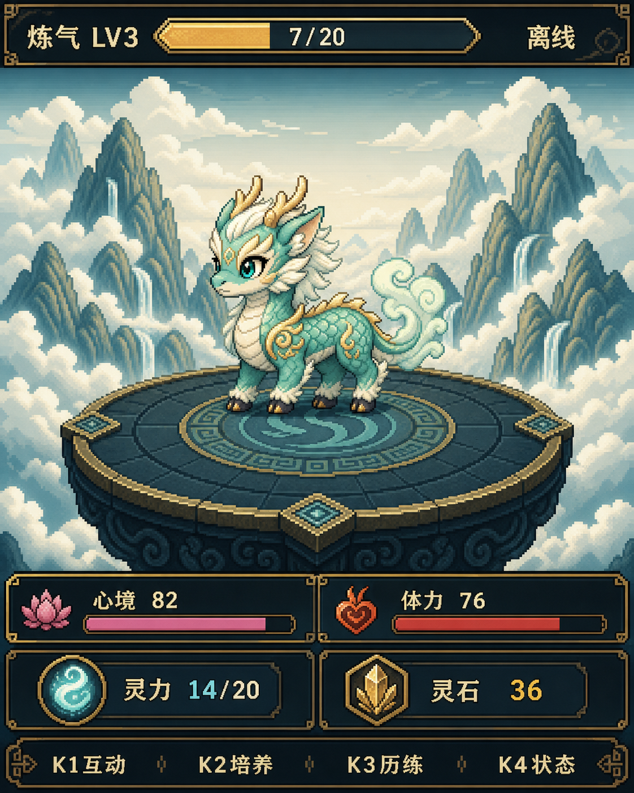

# AI 修仙宠物（RP2040-Zero + ST7735S）

一台运行在 RP2040-Zero 上的离线修仙宠物设备。

当前稳定版本：`v1.0.0`。

它使用 1.8 寸 ST7735S 128×160 彩屏和四个实体按键，支持背包、历练、首领战、分支进化、Flash 存档，并能通过 USB 串口接收 Codex、Claude Code、OpenCode、CodeFree-O 的工作状态。AI 任务成功结束后，宠物会获得经验、灵石和少量灵力。



## 快速开始

需要：一块 RP2040-Zero、一块 1.8 寸 ST7735S 屏（带 K1–K4 按键）、USB-C 数据线、Windows + PowerShell。

```powershell
# 1. 安装工具链 + Python 依赖（仅首次）
powershell -NoProfile -ExecutionPolicy Bypass -File .\scripts\bootstrap-arduino.ps1
py -3 -m pip install -r .\host\requirements-dev.txt

# 2. 编译并烧录固件（按实际 COM 口替换）
powershell -NoProfile -ExecutionPolicy Bypass -File .\scripts\compile-firmware.ps1
powershell -NoProfile -ExecutionPolicy Bypass -File .\scripts\upload-firmware.ps1 -Port COM7

# 3. 跑 Python 测试确认规则一致
py -3 -m pytest .\host\game_model .\host\hooks .\host\diagnostics -q

# 4.（可选）把 AI Hook 装进 Codex / Claude Code / OpenCode / CodeFree-O
powershell -NoProfile -ExecutionPolicy Bypass -File .\scripts\install-ai-hooks.ps1 -Port COM7
```

烧录后屏幕会显示首页。串口发送 `STATUS` 可查看宠物状态。接线见下方[接线表](#接线)。

## 架构概览

```text
AI 工具（Codex / Claude Code / OpenCode / CodeFree-O）
        │  事件钩子 → host/hooks/ai_pet_hook.py
        ▼  JSON over USB Serial (115200, ≤384B)
┌─────────────────────────────────────────────┐
│ 固件 firmware/ai_pet/（RP2040-Zero, C++）       │
│   GameApp ── GameState（规则 + 存档）            │
│           ├─ AiEventProtocol（解析串口 JSON）     │
│           ├─ SaveStore（LittleFS A/B 双槽 + CRC） │
│           ├─ GameUi（六页面渲染）                  │
│           └─ DisplayDevice（ST7735S + 背光）       │
└─────────────────────────────────────────────┘
        ▲  规则镜像
host/game_model/（Python 参考实现 + pytest）
```

**核心设计**：固件的 `game_state.cpp` 与 Python 的 `host/game_model/progression.py` 是同一套游戏规则的两种实现——改规则时两边都要改并保持测试通过。AI 任务成功后按耗时给宠物结算经验、灵石和灵力。

> 面向 AI 助手的开发指南见 [AGENTS.md](AGENTS.md)，包含文件职责、代码规范、关键不变量和常见任务流程。

## 功能

- 中国古风修仙主题和中文 UI。
- 云海仙台背景、麒麟宠物和美术化状态图标。
- 心境、体力、灵力、灵石、等级和经验。
- 背包：灵草、回春丹、符箓和区域信物。
- 功德簿：保存最近 10 条成功 AI 任务记录。
- 历练：三个区域、自动进度和持续经验。
- 战斗：攻击、法诀、丹药、防御。
- 首领可以重复挑战，奖励逐次减半，最低保留 1 点。
- 7 种宠物形态和两次分支进化。
- LV3 从灵卵进化为幼年麒麟，LV12 最终化形。
- Codex、Claude Code、OpenCode、CodeFree-O Hook 状态页。
- AI 成功任务按耗时奖励，重复任务不会重复结算。
- LittleFS 双槽存档、CRC 校验和旧存档迁移。
- PowerShell 编译、烧录、Hook 安装脚本。
- Python 手动 Hook 控制器。

## 硬件

### 主控

- RP2040-Zero
- RP2040 双核 ARM Cortex-M0+
- 2MB Flash
- USB Type-C

### 屏幕

- 1.8 寸 ST7735S TFT
- 128×160
- SPI 接口
- 3.3V 电平
- 板载 K1～K4 四个按键

首版不需要 MicroSD、扬声器或额外传感器。

## 接线

| 屏幕信号 | RP2040-Zero |
|---|---:|
| VCC | 3V3 |
| GND | GND |
| SCL / SCK | GP2 |
| SDA / MOSI | GP3 |
| DC | GP4 |
| CS | GP5 |
| RST | GP6 |
| BLK | GP7 |
| K1 | GP8 |
| K2 | GP9 |
| K3 | GP10 |
| K4 | GP11 |

已验证参数：

- 屏幕初始化：`INITR_BLACKTAB`
- 方向：竖屏向上，按键位于屏幕右侧
- SPI：8MHz
- 按键空闲：HIGH
- 按键按下：LOW
- 背光：HIGH/PWM
- Flash：2MB，Sketch 1792KB，LittleFS 256KB

注意：

- 屏幕必须使用 3.3V 电平。
- 所有模块必须共地。
- 焊接完成后先检查 VCC 与 GND 是否短路。
- K1～K4 当前使用屏幕板载上拉，不需要额外电阻。

## 按键操作

| 按键 | 通用功能 | 首页功能 |
|---|---|---|
| K1 | 确认 | 功德簿 |
| K2 | 上移 | 背包 |
| K3 | 下移 | 历练 |
| K4 | 返回 | 状态 |

功德簿：

- K2 / K3：翻页，每页显示 2 条成功 AI 任务。
- K4：返回首页。

背包页：

- K2 / K3：选择物品。
- K1：使用灵草或回春丹；符箓在首领战前使用。
- K4：返回首页。

历练页：

- K2 / K3：选择区域。
- K1：开始历练；区域进度达到 100% 后进入首领战。
- K4：返回首页。

战斗页：

- K1：攻击。
- K2：法诀。
- K3：丹药。
- K4：防御。

## 成长和进化

每 20 点经验提升一级，最高 LV30。

```text
LV1～LV2  混沌灵卵
    ↓ LV3
凌霄麒麟 / 镇岳麒麟
    ↓ LV12
太虚剑仙 / 九转丹仙 / 不灭武仙 / 万灵仙尊
```

进化分支由长期行为倾向决定：

- 历练、攻击等行为会增加对应战斗倾向。
- 法诀和相关事件会增加灵修倾向。
- 防御会增加稳健倾向。
- 丹药和友善事件会增加亲和倾向。

状态页会显示当前形态、等级、下一阶段和四类倾向。

经验来源：

- 区域一历练：每分钟 1 经验。
- 区域二历练：每分钟 2 经验。
- 区域三历练：每分钟 3 经验。
- 首领胜利：按区域发放基础奖励。
- AI 成功任务：每分钟 2 经验，最少按 1 分钟、最多按 60 分钟。

重复首领奖励依次为 100%、50%、25%、12%……最低经验和灵石均为 1。

## Arduino IDE 烧录

推荐环境：

- Arduino IDE 2.3.x
- Earle F. Philhower RP2040 Core
- Adafruit GFX Library
- Adafruit ST7735 and ST7789 Library
- U8g2 for Adafruit GFX

### 1. 安装 RP2040 Core

在 Arduino IDE 的“文件 → 首选项 → 其他开发板管理器地址”加入：

```text
https://github.com/earlephilhower/arduino-pico/releases/download/global/package_rp2040_index.json
```

在开发板管理器中安装：

```text
Raspberry Pi Pico/RP2040 by Earle F. Philhower, III
```

### 2. 打开草图

```text
firmware/ai_pet/ai_pet.ino
```

### 3. 选择开发板

```text
开发板：Waveshare RP2040 Zero
Flash Size：2MB (Sketch: 1792KB, FS: 256KB)
```

不能选择 `2MB (no FS)`，否则存档无法工作。

### 4. 选择端口并上传

连接 RP2040 后选择新出现的 USB 串口，例如 `COM7`，然后点击“验证”和“上传”。

如果无法进入烧录模式：

1. 按住 `BOOT`。
2. 按一下 `RESET`。
3. 先松开 `RESET`，再松开 `BOOT`。
4. Windows 出现 `RPI-RP2` 磁盘。
5. 返回 Arduino IDE 再次上传。

完整说明见 [Arduino IDE 使用指南](docs/arduino-ide-guide.md)。

## PowerShell 编译和烧录

首次安装本地工具链：

```powershell
powershell -NoProfile -ExecutionPolicy Bypass `
  -File .\scripts\bootstrap-arduino.ps1

py -3 -m pip install -r .\host\requirements-dev.txt
```

编译：

```powershell
powershell -NoProfile -ExecutionPolicy Bypass `
  -File .\scripts\compile-firmware.ps1
```

烧录：

```powershell
powershell -NoProfile -ExecutionPolicy Bypass `
  -File .\scripts\upload-firmware.ps1 -Port COM7
```

最近一次验证结果：

```text
Sketch: 387708 bytes / 1830912 bytes（21%）
RAM:    10468 bytes / 262144 bytes（3%）
```

## AI 工具 Hook

Hook 会把 AI 工作过程映射为修仙状态：

| Hook 状态 | 屏幕文案 |
|---|---|
| `submitted` | 接引任务 |
| `thinking` | 推演中 |
| `tool` | 施法中 |
| `editing` | 炼器中 |
| `waiting` | 等待指令 |
| `blocked` | 修炼受阻 |
| `complete` | 修炼完成并结算 |
| `idle` | 返回首页 |

只有成功完成事件会结算奖励。失败、取消、中间状态都不会增加经验。

### 安装 Hook

```powershell
powershell -NoProfile -ExecutionPolicy Bypass `
  -File .\scripts\install-ai-hooks.ps1 -Port COM7
```

安装器会：

- 将脚本复制到 `%USERPROFILE%\.ai-pet-hooks\`。
- 保存 COM 端口。
- 备份并增量修改 Claude Code 配置。
- 保留已有 CursorLight Codex 通知逻辑。
- 检测到 OpenCode 后安装插件。
- 检测到 CodeFree-O 后安装插件。

安装后重启 Codex、Claude Code、OpenCode 或 CodeFree-O。

### Python 手动触发

```powershell
cd $env:USERPROFILE\.ai-pet-hooks

py -3 .\ai_pet_hook.py submitted
py -3 .\ai_pet_hook.py thinking
py -3 .\ai_pet_hook.py tool
py -3 .\ai_pet_hook.py editing
py -3 .\ai_pet_hook.py waiting
py -3 .\ai_pet_hook.py blocked
py -3 .\ai_pet_hook.py complete
py -3 .\ai_pet_hook.py idle
```

指定来源、会话和串口：

```powershell
py -3 .\ai_pet_hook.py thinking `
  --source claude_code --session demo-1 --port COM7
```

失败和取消：

```powershell
py -3 .\ai_pet_hook.py failure
py -3 .\ai_pet_hook.py cancelled
```

注意：`complete` 会真实修改设备存档并发放奖励。测试时建议使用独立的 `--session` 名称。

完整说明见 [AI Hook 使用指南](docs/ai-hooks-guide.md)。

## 测试

### Python 测试

安装依赖：

```powershell
py -3 -m pip install -r .\host\requirements-dev.txt
```

执行：

```powershell
py -3 -m pytest .\host\game_model .\host\hooks .\host\diagnostics -q
```

测试范围包括：

- 属性、资源和能量恢复。
- 历练、区域解锁和首领战。
- LV3、LV12 分支进化。
- 重复首领奖励递减。
- AI 事件 JSON 协议。
- 任务 ID 去重。
- Hook 状态和持续时间。
- UI 局部刷新结构。
- 串口诊断报告解析。

### 固件编译测试

```powershell
powershell -NoProfile -ExecutionPolicy Bypass `
  -File .\scripts\compile-firmware.ps1
```

编译成功后检查 Flash 和 RAM 用量，避免接近上限。

### 实机 Hook 测试

1. 烧录最新固件。
2. 关闭 Arduino 串口监视器，避免占用 COM7。
3. 执行：

```powershell
cd $env:USERPROFILE\.ai-pet-hooks
py -3 .\ai_pet_hook.py submitted --session smoke-test
py -3 .\ai_pet_hook.py editing --session smoke-test
py -3 .\ai_pet_hook.py complete --session smoke-test
```

预期：

- 屏幕依次显示“接引任务”“炼器中”“修炼完成”。
- 每条命令返回 JSON ACK。
- `complete` 至少增加 2 经验和 1 灵石。

再次使用相同任务 ID 发送完成事件时，设备应返回 `duplicate`，且不重复奖励。

### 串口状态检查

打开 115200 波特率串口，发送：

```text
STATUS
```

设备返回类似：

```text
STATUS level=3 form=1 xp=48 mood=100 stamina=100 coins=69 energy=20 page=0
```

### 不修改存档地预览宠物形态

在串口监视器中发送：

```text
PREVIEW 0
PREVIEW 1
PREVIEW 2
PREVIEW 3
PREVIEW 4
PREVIEW 5
PREVIEW 6
PREVIEW OFF
```

`PREVIEW 0～6` 只临时改变首页和状态页的显示形态，不修改等级、经验、倾向和 Flash 存档。`PREVIEW OFF` 恢复真实形态，设备重启也会自动退出预览。

启用预览后，`STATUS` 会同时报告真实形态和预览形态：

```text
STATUS level=15 form=3 preview=1 preview_form=1 ...
```

## 项目结构

```text
firmware/ai_pet/       Arduino 固件、游戏逻辑、UI、素材头文件
host/game_model/       Python 规则模型和测试
host/hooks/            Codex、Claude Code、OpenCode Hook 与手动控制器
host/diagnostics/      串口诊断验收
assets/raw/            原始美术素材
assets/processed/      处理后的素材和预览
scripts/               工具链、编译、烧录、Hook 安装脚本
docs/                  硬件、Arduino、Hook 和设计文档
```

本地 `硬件/` 目录用于保存实物照片，不纳入 Git。

## 存档

- 存档位于 RP2040 的 256KB LittleFS 分区。
- 使用 A/B 双槽轮换写入。
- 每个存档包含版本、序列号和 CRC32。
- 保存失败时不会覆盖最后一个有效存档。
- 新版本会迁移旧存档。
- 最近任务摘要会保存，用于断电后继续防止重复奖励。

## 常见问题

### 找不到 COM7

- 检查 USB-C 线是否支持数据传输。
- 在设备管理器中查找 `USB 串行设备`。
- COM4、COM5 可能是蓝牙虚拟串口，不是 RP2040。
- 端口变化后重新运行 Hook 安装器并指定新端口。

### Hook 提示串口被占用

关闭 Arduino IDE 串口监视器、其他串口工具和旧的测试程序。

### 屏幕白屏

检查 3V3、GND、GP2～GP7 焊线，确认选择 `INITR_BLACKTAB` 和正确开发板。

### 按键无响应

检查 K1～K4 是否分别连接 GP8～GP11，并确认按下时电平为 LOW。

### 存档无法保存

确认 Flash Size 选择：

```text
2MB (Sketch: 1792KB, FS: 256KB)
```

不要选择 `2MB (no FS)`。

### 中文乱码

源文件必须使用 UTF-8。终端显示乱码不一定代表屏幕字库错误，应以实机显示为准。

## 已验证硬件状态

- ST7735S 128×160：通过。
- 屏幕方向和颜色：通过。
- K1～K4：通过。
- 背光 PWM：通过。
- LittleFS 写入、读取、校验、清理：通过。
- AI Hook ACK、任务奖励、防重复：通过。
- LV3 自动进化：通过。
- Codex、Claude Code、OpenCode、CodeFree-O Hook 联调：通过。
- 30 分钟诊断稳定性测试：通过。

## 后续计划

- 增加更多历练事件和首领。
- 扩充宠物互动、事件文本和长期养成内容。

版本变更见 [CHANGELOG.md](CHANGELOG.md)。
